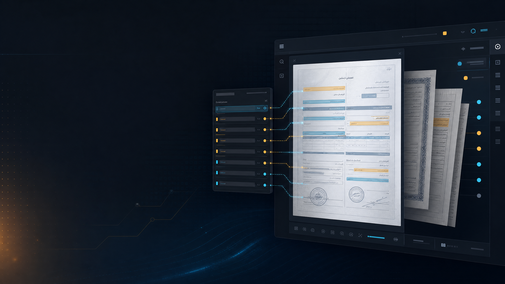

# DocuVision

## Local document intelligence for Arabic and English workflows

DocuVision is a professional desktop workspace for importing documents, running local OCR, reviewing extracted information, and exporting structured results. It is designed for teams that need a clear review process around scanned documents without sending the source files to an external processing service by default.

### Product highlights

| Capability | Description |
|---|---|
| Local OCR | Arabic and English OCR workflows powered by bundled language data. |
| Document intake | Import individual files or scan a complete folder into a local workspace. |
| Review queue | Move from imported document to OCR review, correction, and approval. |
| Structured fields | Correct extracted fields alongside the original document preview. |
| Search | Search file names, OCR text, and extracted values. |
| Export | Export reviewed data as JSON or CSV for downstream workflows. |
| Desktop delivery | Windows portable executable plus Linux AppImage and Debian packages. |
| Privacy-oriented workflow | Documents and OCR results remain in the local application workspace. |

### Designed for

DocuVision is suitable for document intake teams, archives, administrative workflows, local records processing, and organizations working with Arabic/French/English document collections. It is intended to support human review rather than silently making business decisions from OCR output.

### Product status

The current product is an Electron desktop application with a redesigned RTL interface, local persistence, document preview, OCR processing, review states, and export tools. A commercial edition can be adapted for customer-specific fields, packaging, deployment, support, and workflows.

### Commercial availability

The implementation source is not included in this showcase repository. For a product demonstration, commercial license, custom deployment, or Windows/Linux delivery, contact **Bilel JM** at [bileljammazi6@gmail.com](mailto:bileljammazi6@gmail.com) or open a private business inquiry through GitHub.

Commercial terms can cover the licensed edition, number of installations, updates, support, customization, and deployment assistance. A final agreement should be reviewed by qualified legal counsel before sale.

### What this repository contains

This public repository contains product presentation material only: the overview, visual asset, capabilities, and commercial information. It intentionally excludes application source code, dependencies, `.env` files, customer documents, OCR models, build directories, and release artifacts.

---

**DocuVision — review documents clearly, keep workflows local, export useful results.**
